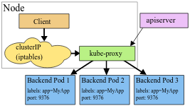
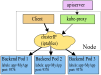
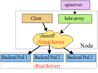

# gRPC 在 Kubernetes 中的负载均衡


## 背景

新公司服务在往 Kubernetes 上迁移，让我着手处理一个负载不均衡的问题，给到的描述是一个前台服务提供 API，后面挂两个 TensorFlow Model Server，其中后面的俩个服务存在负载不均衡的问题。

考虑到内部服务是基于 kube-proxy 的 L4 负载均衡，TensorFlow Model Server 是基于 gRPC 的，而 gRPC 是基于 HTTP2 的，第一反应是由于 HTTP2 连接复用导致的负载不均衡问题[^grpc-in-k8s]，这里记录下验证过程和提供一些解决思路。

[^grpc-in-k8s]: [gRPC Load Balancing on Kubernetes without Tears](https://kubernetes.io/blog/2018/11/07/grpc-load-balancing-on-kubernetes-without-tears/)

## 验证假设

这里部署了一个 grpcbin[^grpcbin] 服务用来测试 gRPC 服务的负载均衡：

[^grpcbin]: [grpcbin](https://github.com/moul/grpcbin)



其中 `resource` QoS class[^qos] 设置为 `Guaranteed`，
确保 POD 资源是稳定的。

[^qos]: [QoS class](https://kubernetes.io/docs/tasks/configure-pod-container/quality-service-pod/#qos-classes)

为了方便测试，这里使用 NodePort 类型的 Service 暴露出服务。不影响 kube-proxy 对服务的负载均衡。

测试客户端使用 ghz[^ghz]，一个用于 gRPC 压力测试的工具，配置如下：

[^ghz]: [ghz](https://ghz.sh/docs/intro)





### 使用 1 个连接进行测试

```text
➜ kubectl top pod
NAME                       CPU(cores)   MEMORY(bytes)
grpcbin-7556ccbccb-rp6m9   0m           6Mi
grpcbin-7556ccbccb-v2pgq   861m         10Mi
grpcbin-7556ccbccb-wdpbq   0m           6Mi
```

运行稳定后可以看到只有 `grpcbin-7556ccbccb-v2pgq` 这个 POD 有负载。

### 使用 3 个连接进行测试

```text
➜ kubectl top pod
NAME                       CPU(cores)   MEMORY(bytes)
grpcbin-7556ccbccb-rp6m9   357m         9Mi
grpcbin-7556ccbccb-v2pgq   518m         10Mi
grpcbin-7556ccbccb-wdpbq   0m           6Mi
```

运行稳定后可以看到 `grpcbin-7556ccbccb-rp6m9`，`grpcbin-7556ccbccb-v2pgq` 这两个 POD 负载接近 1:2，即两者连接数分别为 1 和 2，这是因为集群 kube-proxy 使用的模式是 iptables，连接负载策略是随机的。

## 解释

官方对 kube-proxy 的特点总结很清晰[^kube-proxy]：

[^kube-proxy]: [Proxies in Kubernetes](https://kubernetes.io/docs/concepts/cluster-administration/proxies/)

>The kube proxy:
>
>- runs on each node  # 运行在每个节点
>- proxies UDP, TCP and SCTP # 可以代理UDP、TCP、SCTP协议
>- does not understand HTTP  # 但是不能识别HTTP协议
>- provides load balancing  # 提供负载均衡
>- is just used to reach services # 只用于到达服务

也就是说：

- kube-proxy 是一个 L4 负载均衡器，只支持**连接**级别负载均衡；
- gRPC 传输协议基于 HTTP2，使用了连接复用特性，客户端一般只会持有一个连接；
- 因此当连接建立后，后续的请求只会发送到该连接对应的节点。

## 解决方案

### 使用客户端负载均衡器

1. 使用 Headless Service[^headless]，通过 DNS 直接返回一组 POD 地址；
2. gRPC 的客户端代码使用提供的负载均衡功能[^balancer]，同时使用 DNS Resolver [^resolver]实现客户端负载均衡器。

[^headless]: [Headless Service](https://kubernetes.io/docs/concepts/services-networking/service/#headless-services)
[^balancer]: [Load Balancing in gRPC](https://github.com/grpc/grpc/blob/master/doc/load-balancing.md)，[google.golang.org/grpc/balancer](https://pkg.go.dev/google.golang.org/grpc/balancer?tab=doc)
[^resolver]: [gRPC Name Resolution](https://github.com/grpc/grpc/blob/master/doc/naming.md)

这种方案能够在不改变集群网络架构的情况下支持 gRPC 的负载均衡，但是还是有一些缺陷：

1. 使用 Headless Service 和 DNS Resolver 会增大　CoreDNS 的压力；
2. DNS Resolver 会有缓存，对服务的节点变化不够迅速；
3. 方案有侵入性且适用性差。

### 验证客户端负载均衡器方案

服务端测试代码及部署配置：





客户端测试代码及部署配置：





客户端测试代码使用 DNS 解析服务器地址，并使用 `roundrobin` 负载均衡策略。

我们首先测试的是设置 `clusterIP: None` 的情况（即使用 Headless Service），可以看到客户端输出的日志是符合预期的，请求会轮询服务器连接：

```text
2020/05/25 07:12:45 target: dns:///echo-server:9000
2020/05/25 07:12:46 (from echo-server-866cff6884-66kj8): reply message 1
2020/05/25 07:12:47 (from echo-server-866cff6884-967bx): reply message 2
2020/05/25 07:12:48 (from echo-server-866cff6884-xsds5): reply message 3
2020/05/25 07:12:49 (from echo-server-866cff6884-66kj8): reply message 4
2020/05/25 07:12:50 (from echo-server-866cff6884-967bx): reply message 5
2020/05/25 07:12:51 (from echo-server-866cff6884-xsds5): reply message 6
```

当取消设置 `clusterIP: None` 后再重新部署客户端，此时客户端只能利用到一个服务器连接，

```text
2020/05/25 07:14:02 target: dns:///echo-server:9000
2020/05/25 07:14:03 (from echo-server-6dcb87cb69-ws2gf): reply message 1
2020/05/25 07:14:04 (from echo-server-6dcb87cb69-ws2gf): reply message 2
2020/05/25 07:14:05 (from echo-server-6dcb87cb69-ws2gf): reply message 3
2020/05/25 07:14:06 (from echo-server-6dcb87cb69-ws2gf): reply message 4
2020/05/25 07:14:07 (from echo-server-6dcb87cb69-ws2gf): reply message 5
2020/05/25 07:14:08 (from echo-server-6dcb87cb69-ws2gf): reply message 6
```

也就是说 gRPC 客户端基于 DNS 解析的负载均衡是需要配合 Headless Service 来使用的。

当然 gRPC 框架自带了其他解析器和负载均衡策略的，这里只是选择了最常见的场景，更复杂的常见是可以通过自定义解析器和负载均衡策略来实现。

另外像 Dubbo 之类的 RPC 框架也是支持配置客户端负载均衡策略的。[^dubbo-load-balance]

[^dubbo-load-balance]: [Dubbo的负载均衡](http://dubbo.apache.org/zh-cn/blog/dubbo-loadbalance.html)

### 使用服务端负载均衡器

使用 L7 负载均衡器，例如 Linkerd, Envoy。如果条件允许的话，可以使用 istio 之类的服务网格产品。

## 关于 kube-proxy 负载均衡策略

kube-proxy 支持三种模式[^vip-and-proxy]：

[^vip-and-proxy]: [VIP 和 Service 代理](https://kubernetes.io/zh/docs/concepts/services-networking/service/#virtual-ips-and-service-proxies)

- usersapce: 用户空间内的负载均衡，负载均衡支持轮询策略，性能一般；



- iptables: 完全使用 iptables 实现相关功能，只支持随机负载均衡，性能较好；



- ipvs: 基于 ipvs 做负载均衡，使用 iptables 实现 Cluster IP，包过滤，SNAT 或 masquerade[^ipvs-fallback]，性能最好，支持较多负载均衡策略，默认是轮询，可通过 `--ipvs-scheduler` 参数配置。

[^ipvs-fallback]: [When IPVS falls back to IPTABLES](https://github.com/kubernetes/kubernetes/blob/master/pkg/proxy/ipvs/README.md#when-ipvs-falls-back-to-iptables)



关于是否有必要选择从 iptables 切换到 ipvs 模式，可以参考这两篇文章：

- [Comparing kube-proxy modes: iptables or IPVS?](https://www.projectcalico.org/comparing-kube-proxy-modes-iptables-or-ipvs/)
- [话说kubernetes网络疑难杂症](https://yuerblog.cc/2020/03/06/%E8%AF%9D%E8%AF%B4kubernetes%E7%BD%91%E7%BB%9C%E7%96%91%E9%9A%BE%E6%9D%82%E7%97%87/)

基本结论是：

- 集群服务超过 1000 个时，使用 ipvs 能获得较明显的性能提升，具体数值取决于集群实际情况，但如果主要使用长连接的服务，使用 ipvs 的效果提升是有限的。
- ipvs 模式下线规则时候的一个 bug，会导致新连接发送到已经下线的POD内，如果无法接受就需要等官方修复。

### 如何在已经启动的集群修改 kube-proxy 配置

当然如果确定要将已上线的集群的 kube-proxy 模式设置为 ipvs 的话，这里也提供一些指引。

使用 kubeadm 安装：

- [集群管理 - 维护节点](https://kubernetes.io/zh/docs/tasks/administer-cluster/cluster-management/#%E7%BB%B4%E6%8A%A4%E8%8A%82%E7%82%B9)
- [kubeadm upgrade](https://kubernetes.io/docs/reference/setup-tools/kubeadm/kubeadm-upgrade/)

使用 Rancher 安装：

[Rancher 2.x - 设置集群](https://rancher2.docs.rancher.cn/docs/cluster-admin/editing-clusters/_index)

使用 RKE 安装：

[RKE - How Upgrades Work](https://rancher.com/docs/rke/latest/en/upgrades/how-upgrades-work/)

