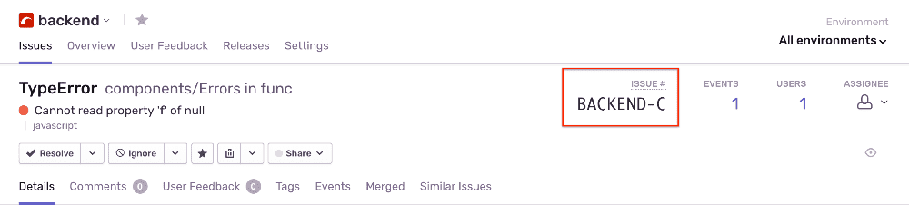
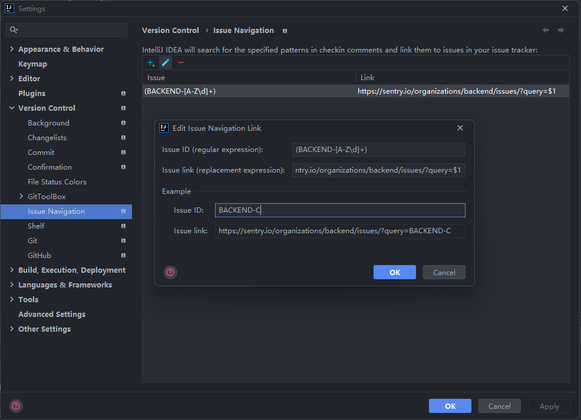

# Jetbrains IDE 配置 Sentry Issue 识别

Issue ID: `(<编号前缀>-[A-Z\d]+)`
Issue link: `https://sentry.io/organizations/<项目>/issues/?query=$1`

例：

### 参考：

- [Add Issue Navigation Link Dialog | IntelliJ IDEA](https://www.jetbrains.com/help/idea/2021.2/add-issue-navigation-link-dialog.html)
- [Resolve a Short ID | Sentry Documentation](https://docs.sentry.io/api/organizations/resolve-a-short-id/)
- [What is a short ID? - Meta - #sentry](https://forum.sentry.io/t/what-is-a-short-id/1248)

