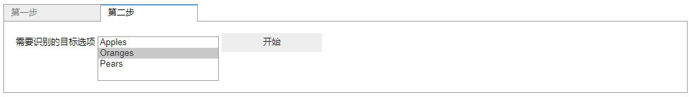

# Jupyter Notebook 前端交互部件实现


# Jupyter Notebook 介绍[^1]

Jupyter Notebook 是一个基于提供了开发, 记录, 执行和展现结果等过程的Web应用.

# Jupyter Notebook 实现原理[^2]

Jupyter Notebook 除了用于前端交互的 Web组件外, 其核心功能是与通过 IPython 内核通信实现的.

## IPython 内核

IPython 内核是一个提供了代码执行, 输入提示等功能的独立进程, 前端通过 ZeroMQ 套接字连接并使用 JSON 消息通信.


## Jupyter Notebook

Jupyter Notebook 的实现添加了一个额外的服务中间件来完成消息的转发工作, 这样不仅能够提供本身文件管理方面的功能, 也使得其内核变成一个可替换的组件, 这也是为什么 Jupyter Notebook 能够作为多种语言前端的原因.


# Jupyter Notebook 交互部件的实现[^3][^4]

本质上, Jupyter Notebook 交互部件是一个特殊的 Jupyter Notebook 插件, 它的前端使用 JavaScript 编写, 后端逻辑由指定的内核语言编写, 在这里我们使用的是 Python, 因此我们直接继承 `ipywidgets.DOMWidget` 来完成核心逻辑的实现, 这里我们需要 `traitlets` 模块来帮我们完成前后端数据的同步.

基本结构如下:


## Python 代码

```Python
class FileUploadWidget(ipywidgets.DOMWidget):
    _view_name = traitlets.Unicode('FileUploadView').tag(sync=True)
    _view_module = traitlets.Unicode('fileupload').tag(sync=True)

    accept = traitlets.Unicode(help='Filetype acceptable.').tag(sync=True)
    filename = traitlets.Unicode(help='Filename of `data`.').tag(sync=True)
    data_base64 = traitlets.Unicode(help='File content, base64 encoded.').tag(
        sync=True)
    data = traitlets.Bytes(help='File content.')

    def __init__(self, accept, *args, **kwargs):
        super(FileUploadWidget, self).__init__(*args, **kwargs)
        self._dom_classes += ('widget_item', 'btn-group')
        self.accept = accept

    def _data_base64_changed(self, *args):
        self.data = base64.b64decode(self.data_base64.split(',', 1)[1])
```

这个类中, 我们实现了一个名为 `FileUploadWidget` 的部件类, 其中 `_view_name` , `_view_module` 分别是用于说明与前端哪个模块中的哪个视图进行同步, 其他四个属性则是我们需要同步的属性.

其中, 比较特殊的是 `data` 属性, 由于我们上传文件使用的是 `<input type="file"/>` 标签, 然后利用浏览器接口 ``FileReader`` 读取文件内容, 而其内容是经过 ``base_64`` 编码的, 为了使用上的方便, 我们将前端读到的 base64 编码内容存到 `data_base64` 属性中, 再通过实现 `_data_base64_changed` 事件回调函数, 当文件内容发生变化时, 自动将 base64 编码内容转换为字节数组.

## JavaScript 代码

```JavaScript
requirejs.undef('fileupload');
define('fileupload', ['jupyter-js-widgets'], function (widgets) {
    'use strict';
    let FileUploadView = widgets.DOMWidgetView.extend({
        render: function render () {
            FileUploadView.__super__.render.apply(this, arguments);
            let element = document.createElement('input');
            element.setAttribute('type', 'file');
            element.setAttribute('accept', this.model.get('accept'));

            this.el.appendChild(element);
            if (/^image\//.test(this.model.get('accept'))){
                let img = document.createElement("img");
                img.setAttribute('id', 'uploadPreview');
                img.setAttribute('width', '80%');
                this.el.appendChild(img);
            }
        },
        events: {
            'change': '_handleFileChange'
        },
        _handleFileChange: function _handleFileChange (ev) {
            let file = ev.target.files[0];
            let that = this;
            if (file) {
                // https://developer.mozilla.org/zh-CN/docs/Web/API/FileReader
                let fileReader = new FileReader();
                fileReader.onload = function fileReaderOnload (e) {
                    that.model.set('data_base64', fileReader.result);
                    that.touch();
                    let preview = document.getElementById("uploadPreview");
                    if(preview !== null){
                        preview.src = e.target.result;
                    }
                };
                fileReader.readAsDataURL(file);
            }
            else {
                that.send({ ev: 'Unable to open file.' });
            }
            that.model.set('filename', file.name);
            that.touch();
        }
    });
    return {FileUploadView: FileUploadView};
});
```

JavaScript 代码中, ``render`` 函数用于渲染前端页面, ``events`` 用于描述事件回调函数, 这里的基本逻辑就是当 `<input/>` 标签中的文件路径值变化时重新读取文件内容.

## 整合

我们把自带的部件和我们自己实现的部件结合在一起, 统一初始化便得到了最后的交互面板.

```Python
class InteractPanel:
    def __init__(self):
        # 选择识别目标的部件
        self.selection = ipywidgets.SelectMultiple(
            options=['Apples', 'Oranges', 'Pears'],
            value=['Oranges'],
            description='需要识别的目标选项',
            disabled=False)
        # 图片上传部件
        self.image = FileUploadWidget(accept='image/*')
        # 开始计算部件
        btn = ipywidgets.Button(description='开始', disabled=False)
        btn.on_click(self.on_button_click)
        # 交互面板部件
        self.panel = ipywidgets.Tab(
            children=[self.image, ipywidgets.HBox([self.selection, btn])])
        self.panel.set_title(0, '第一步')
        self.panel.set_title(1, '第二步')

    def on_button_click(self, button):
        # 点击开始按钮所进行的操作
        # 保存文件
        #with open('需要保存的文件路径', 'wb') as fp:
        #    fp.write(self.image.data)
        # 获取选项
        # value = self.selection.value
        # 执行
        #!caffe 命令参数
        pass

    def display(self):
        display(self.panel)
```

最终效果如:




第一步, 选择需要进行处理的图片, 第二步选择需要识别的目标, 然后点击开始按钮进行处理的工作. 整个过程只显示了一个交互面板, 同时满足的美观性和实用性的要求.

[^1]: http://jupyter-notebook.readthedocs.io/en/latest/notebook.html#introduction
[^2]:http://jupyter.readthedocs.io/en/latest/architecture/how_jupyter_ipython_work.html#how-ipython-and-jupyter-notebook-work
[^3]: https://ipywidgets.readthedocs.io/en/latest/examples/Widget%20Custom.html
[^4]: https://github.com/peteut/ipython-file-upload
[^5]: http://jupyter-notebook.readthedocs.io/en/latest/notebook.html#introduction

