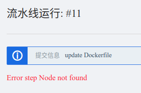
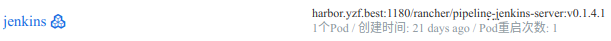
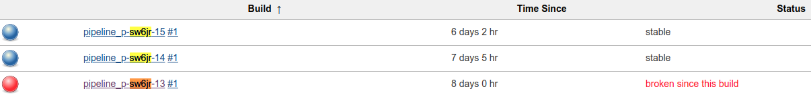
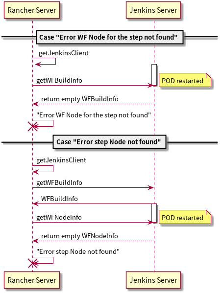
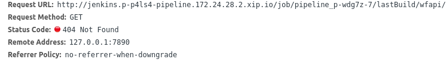
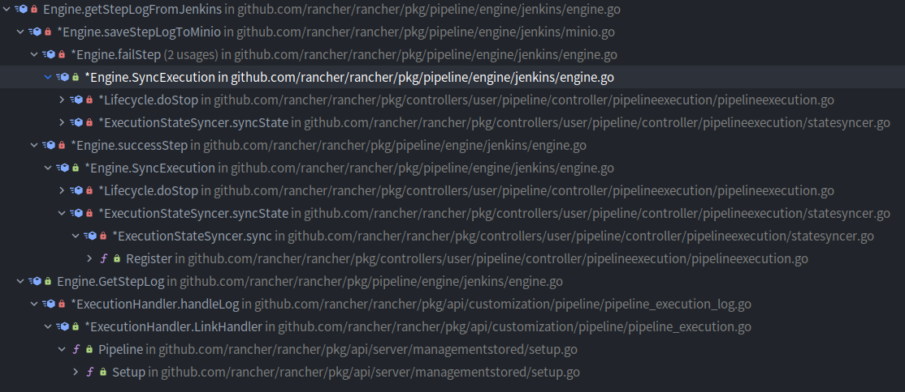
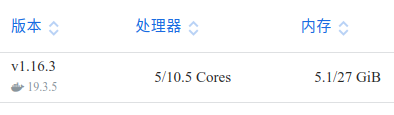
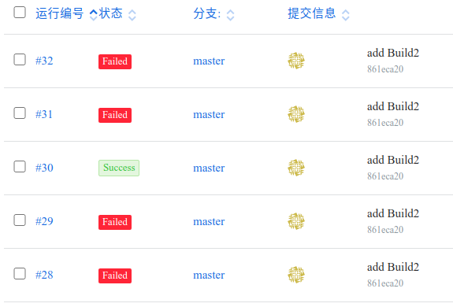
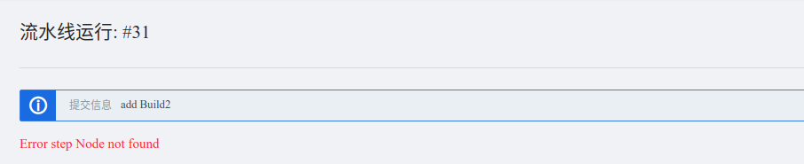
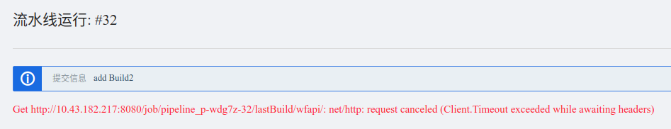

# Rancher 流水线随机失败问题




最近在使用 Rancher 测试集群时流水线会偶发性的失败，提示 `"Error step Node not found"`，稍微搜索了一下在官方找到了一个 issue[^issue]，问题描述如下：

---

[^issue]: [Randomly getting the "Error step Node not found" exception #22478](https://github.com/rancher/rancher/issues/22478)

流水线分为多个阶段，每个阶段会有多个步骤同时进行，流水线执行时会有一定概率出现以下三种问题：

- `"Error WF Node for the step not found"`
- `"Error step Node not found"`
- `"Get http://10.43.219.169:8080/job/pipeline_p-jhz9s-528/lastBuild/wfapi/: net/http: request canceled (Client.Timeout exceeded while awaiting headers)"`

并提供了错误产生的代码位置： https://github.com/rancher/rancher/blob/0f081729cac35b18bdd7ff2922da4f9e0db7701c/pkg/pipeline/engine/jenkins/engine.go#L613

用户尝试了以下操作：

- 添加了一台 64GB 内存的机器
- 升级 Rancher 版本到 2.3.2
- 将发布阶段的多个步骤拆分到了多个阶段，不再并行执行

结果是**错误仍然出现但概率降低了**。

---

稍加分析，从这个 issue 能推断出哪些信息呢？

1. WHERE: 至少在 Rancher 2.3.2 问题仍然是存在的，并且有错误输出的代码位置
2. HOW: 添加机器，拆分流水线能降低问题发生概率降低了，问题可能和容器运行时的资源有关，比如 OOM 导致容器被杀死
3. WHEN: 有多种错误会出现，问题可能发生在不同的阶段
4. WHO: 外部请求失败，可能是流水线依赖的服务出现了问题

## Rancher 流水线基本概念和原理

- [流水线中的概念](https://rancher2.docs.rancher.cn/docs/k8s-in-rancher/pipelines/concepts/_index)
- [流水线的工作原理](https://rancher2.docs.rancher.cn/docs/k8s-in-rancher/pipelines/_index/#%E6%B5%81%E6%B0%B4%E7%BA%BF%E7%9A%84%E5%B7%A5%E4%BD%9C%E5%8E%9F%E7%90%86)

rancher 流水线基本上只是对 jenkins 进行简单的封装，基本原理如下：

1. 通过授权拿到代码仓库信息，创建代码仓库 Webhook 用于触发流水线
2. 流水线触发时 `.rancher-pipeline.yml` 流水线配置会被转换成 jenkins Pipeline 脚本
3. rancher server 通过 jenkins API 与 jenkins master 交互，创建 job
4. jenkins master 创建 slave （buildpod）执行流水线
5. rancher server 通过 jenkins API 同步状态及日志

以下面的流水线配置为例：

```yaml
stages:
  - name: Stage1
    steps:
      - runScriptConfig:
          image: busybox
          shellScript: |-
            echo "this is stage 1 step 1"
      - runScriptConfig:
          image: busybox
          shellScript: |-
            echo "this is stage 1 step 2"
  - name: Stage2
    steps:
      - runScriptConfig:
          image: busybox
          shellScript: |-
            echo "this is stage 2 step 1"
      - runScriptConfig:
          image: busybox
          shellScript: |-
            echo "this is stage 2 step 2"
timeout: 60
notification: {}
```

实际执行会被转换成如下 jenkins Pipeline 脚本：

```groovy
import org.jenkinsci.plugins.pipeline.modeldefinition.Utils
def label = "buildpod.${env.JOB_NAME}.${env.BUILD_NUMBER}".replace('-', '_').replace('/', '_')
podTemplate(label: label, instanceCap: 1, yaml: '''
apiVersion: v1
kind: Pod
metadata:
  creationTimestamp: null
  labels:
    app: jenkins
    execution: p-dv8kn-5
  namespace: p-f5pd2-pipeline
spec:
  affinity:
    nodeAffinity:
      preferredDuringSchedulingIgnoredDuringExecution:
      - preference:
          matchExpressions:
          - key: pipeline.project.cattle.io/node
            operator: In
            values:
            - jenkins
        weight: 100
    podAntiAffinity:
      preferredDuringSchedulingIgnoredDuringExecution:
      - podAffinityTerm:
          labelSelector:
            matchExpressions:
            - key: app
              operator: In
              values:
              - jenkins
          topologyKey: kubernetes.io/hostname
        weight: 100
  containers:
  - command:
    - cat
    env:
    ...
    image: rancher/pipeline-tools:v0.1.14
    name: step-0-0
    resources:
      limits:
        cpu: 300m
        memory: 100Mi
      requests:
        cpu: 10m
        memory: 10Mi
    tty: true
  ...x3...
  - args:
    - $(JENKINS_SECRET)
    - $(JENKINS_NAME)
    env:
    ...
    image: rancher/jenkins-jnlp-slave:3.35-4
    name: jnlp
    resources:
      limits:
        cpu: "1"
        memory: 1Gi
      requests:
        cpu: 10m
        memory: 10Mi
...
'''
) {
    node(label) {
        timestamps {
            timeout(60) {
                stage('Clone'){
                    parallel 'step-0-0': {
                        stage('step-0-0'){
                            container(name: 'step-0-0') {
                                checkout([$class: 'GitSCM', branches: [[name: 'local/temp']], doGenerateSubmoduleConfigurations: false, extensions: [[$class: 'CloneOption', honorRefspec: true, noTags: false, reference: '', shallow: true]], userRemoteConfigs: [[url: 'http://gitlab.yzf.net/zhouerliang/pipeline-test.git', refspec: '+refs/heads/sample-pipeline:refs/remotes/local/temp', credentialsId: 'p-dv8kn-5']]])
                            }
                        }
                    }
                }
                stage('Stage1'){
                    parallel 'step-1-0': {
                        stage('step-1-0'){
                            container(name: 'step-1-0') {
                                sh ''' echo "this is stage 1 step 1" '''
                            }
                        }
                    },'step-1-1': {
                        stage('step-1-1'){
                            container(name: 'step-1-1') {
                                sh ''' echo "this is stage 1 step 2" '''
                            }
                        }
                    }
                }
                stage('Stage2')
                ...
            }
        }
    }
}
```

注意这里

- `nodeAffinity`，尽量选择标记了 `jenkins` 的节点，应当是对专门流水线节点的支持
- `podAntiAffinity`，尽量将流水线的 pod 不放在一起，应当是因为 `rancher/jenkins-jnlp-slave`[^slave] 使用了 dind[^dind]，将 pod 打散避免执行阻塞住

[^dind]:[jpetazzo/dind](https://github.com/jpetazzo/dind)

[^slave]: [rancher/jenkins-slave](https://github.com/rancher/jenkins-slave/blob/master/Dockerfile#L37)

另外，rancher 实际只是将 jenkins 服务作为执行引擎，不依赖任何 jenkins 存储任何执行记录，流水线相关的配置和执行记录通过 rancher 集群的 CRD 完成。

```text
pipelineexecutions.project.cattle.io
pipelines.project.cattle.io
pipelinesettings.project.cattle.io
```

换句话说，jenkins master pod 重启会导致其 build 数据丢失，但不影响流水线记录数据。

下面的内容中，关于 jenkins 的一些概念这里也补充说明下：

- Workflow，其实就是 jenkins Pipeline 的曾用名
- Node, node, agent 以及 slave 都用来指被 jenkins master 管理的用来执行 jenkins jobs 的服务器。主要区别是 agents 用在表述性pipeline中，可以不仅仅是 nodes，还可以是容器等， 而 node 用在脚本化pipeline中[^node]。

[^node]: [Pipeline syntax overview](https://www.jenkins.io/doc/book/pipeline/#pipeline-syntax-overview)

## 问题分析

<!-- https://github.com/rancher/api-spec/blob/master/specification.md

"github.com/rancher/types/apis/project.cattle.io/v3"

定义了流水线相关的接口

pkg/controllers/user/pipeline/controller/pipelineexecution/pipelineexecution.go:97 -->

```go
func (j Engine) getStepLogFromJenkins(execution *v3.PipelineExecution, stage int, step int) (string, error) {
	if len(execution.Status.Stages) <= stage || len(execution.Status.Stages[stage].Steps) <= step {
		return "", errors.New("invalid step index")
	}
	jobName := getJobName(execution)
	client, err := j.getJenkinsClient(execution)
	if err != nil {
		return "", err
	}
	info, err := client.getWFBuildInfo(jobName)
	if err != nil {
		return "", err
	}
	WFnodeID := ""
	for _, jStage := range info.Stages {
		if jStage.Name == fmt.Sprintf("step-%d-%d", stage, step) {
			WFnodeID = jStage.ID
			break
		}
	}
	if WFnodeID == "" {
		return "", errors.New("Error WF Node for the step not found")
	}
	WFnodeInfo, err := client.getWFNodeInfo(jobName, WFnodeID)
	if err != nil {
		return "", err
	}
	if len(WFnodeInfo.StageFlowNodes) < 1 {
		return "", errors.New("Error step Node not found")
	}
	logNodeID := WFnodeInfo.StageFlowNodes[0].ID
	logrus.Debugf("trying getWFNodeLog, %v, %v", jobName, logNodeID)
	nodeLog, err := client.getWFNodeLog(jobName, logNodeID)
	if err != nil {
		return "", err
	}

	return nodeLog.Text, nil
}
```

1. 初始化 `JenkinsClient`
2. 根据 `jobName` 获取 `WFBuildInfo`
3. 遍历 `WFBuildInfo` 找到 `WFnodeID`
4. 根据 `WFnodeID` 获取 `WFnodeInfo`
5. 根据 `WFnodeInfo` 获取 `logNodeID`
6. 根据 `logNodeID` 获取 `nodeLog`

可以看到这个接口基本上就是请求 jenkins master 服务，再不同的参数间转换直到拿到执行日志。

从报错的位置来看，`"Error WF Node for the step not found"`，`"Error step Node not found"` 这两种报错都是因为返回的数据异常导致的。

会不会是 jenkins 重启导致的呢？看一下工作负载，果然有一次重启。



`p-sw6jr` 是流水线出现问题的项目，从 jenkins build 记录来看，编号为 `11` 的记录丢失了：



这时候，看上去问题比较清晰了，jenkins 重启的时机不同会导致产生不同的错误。

当发出请求时，jenkins 正在重启，则出现请求失败，另外两种错误则是重启的时间不同产生的：



## 真的是这样吗？

进一步浏览代码，发现 rancher 代码对从 jenkins 拿到的响应都是有检查的！

```go
func checkHTTPError(resp *http.Response, event string) error {
	if resp == nil {
		return nil
	}
	if resp.StatusCode < http.StatusOK || resp.StatusCode >= http.StatusBadRequest {
		data, _ := ioutil.ReadAll(resp.Body)
		return httperror.NewAPIErrorLong(resp.StatusCode, fmt.Sprintf("%s got %d", event, resp.StatusCode), string(data))
	}
	return nil
}
```



如果是重启后再去请求相关的数据，当数据不存在时会返回 404 状态码并被客户端检测到！如果请求时有任何错误或者响应状态码校验不通过都会直接导致报错。也就是说我们遇到的情况从逻辑上说有两种可能：

1. 请求没有出错，响应不为空且状态码正常，但是没有返回相关字段的数据
2. 请求没有出错，响应为空，此时相关的函数会返回空对象导致出错

对于第二种可能，通过阅读 `http.Client` 相关代码发现，只要请求没有出错，响应就一定不为空，那么也就是只有第一种可能，**jenkins 服务返回了不完整的数据**。



## 问题复现

测试集群使用单台服务器，配置如图：



这里使用 2 个 stage，每个 stage 10 个 step 来进行测试，模拟**多并发步骤，高负载**的场景。

```yaml
stages:
  - name: Build
    steps:
      - runScriptConfig:
          image: golang:1.14
          shellScript: |-
            go env -w GO111MODULE=on
            go env -w GOPROXY=https://goproxy.cn,direct
            go install github.com/gohugoio/hugo
      ...x9...
  - name: Build2
    steps:
    - runScriptConfig:
        image: golang:1.14
        shellScript: |-
          go env -w GO111MODULE=on
          go env -w GOPROXY=https://goproxy.cn,direct
          go install github.com/gohugoio/hugo
    ...x9...
timeout: 60
notification: {}
```

### 使用重启 jenkins 的方式复现错误

这里使用杀死 jenkins 容器的方式做到让 pod 强制重启：

```shell
kubectl exec -it [POD_NAME] -c [CONTAINER_NAME] -- /bin/sh -c "kill 1"
```

经过多次测试，大部分情况下会报连接不上 jenkins 服务的错误，在第 7 次时出现 `"Error step Node not found"`，看上去和实际情况不太一样，决定换一种复现方式。

### 直接同时触发多个流水线复现错误

直接同时触发多个流水线后，果然多次出现了 `"Error step Node not found"`，同时 jenkins 服务也没有发生重启，证明 jenkins 服务重启并不是错误出现的必要条件。

拿到两次典型的流水线执行过程进行分析：

#### PipelineExecution: p-wdg7z-24



```go
package jenkins

const (
  ...
	JenkinsWFBuildInfoURI = "/job/%s/lastBuild/wfapi"
	JenkinsWFNodeInfoURI  = "/job/%s/lastBuild/execution/node/%s/wfapi"
	JenkinsWFNodeLogURI   = "/job/%s/lastBuild/execution/node/%s/wfapi/log"
  ...
)
```

使用代码中使用到的 API[^pipeline-api] 请求相关数据。



[^pipeline-api]:[Pipeline REST API Plugin](https://github.com/jenkinsci/pipeline-stage-view-plugin/blob/master/rest-api/README.md)

#### PipelineExecution: p-wdg7z-25







从这两个测试用例发现了些什么呢？

1. `pipeline_p-wdg7z-25_step-1-4` 的 `stageFlowNodes` 为空，会触发 `"Error step Node not found"`，搜索后找到了一个 Jenkins issue:

   [JENKINS-59279: Required context class hudson.FilePath is missing](https://issues.jenkins-ci.org/browse/JENKINS-59279)

   也就是说根源问题应该是和 jenkins 在容器环境下执行有关

2. `p-wdg7z-24` jenkins build 记录没有任何报错，但是仍然出现了 `"Error step Node not found"`
3. jenkins 服务没有发生重启

另外，通过多次测试，当两个测试的流水线调度到同一天机器上，后一个几乎一定会失败：







在此场景下，jenkins 服务连通性也会有一些问题，通过监控观察，应当是 CPU 负载过高导致服务无响应。同时此时还会有 slave 连接不上 jenkins 导致 buildpod 泄漏的情况。

```text
buildpod.pipeline-p-wdg7z-17.1-mkkqk-cgj16 jnlp Jun 02, 2020 2:03:29 AM org.jenkinsci.remoting.engine.JnlpAgentEndpointResolver waitForReady
buildpod.pipeline-p-wdg7z-17.1-mkkqk-cgj16 jnlp INFO: Failed to connect to the master. Will try again: java.net.SocketTimeoutException connect timed out
buildpod.pipeline-p-wdg7z-17.1-mkkqk-cgj16 jnlp Jun 02, 2020 2:03:44 AM org.jenkinsci.remoting.engine.JnlpAgentEndpointResolver waitForReady
buildpod.pipeline-p-wdg7z-17.1-mkkqk-cgj16 jnlp INFO: Failed to connect to the master. Will try again: java.net.SocketTimeoutException connect timed out
buildpod.pipeline-p-wdg7z-17.1-mkkqk-cgj16 jnlp Jun 02, 2020 2:03:59 AM org.jenkinsci.remoting.engine.JnlpAgentEndpointResolver waitForReady
buildpod.pipeline-p-wdg7z-17.1-mkkqk-cgj16 jnlp INFO: Failed to connect to the master. Will try again: java.net.SocketTimeoutException connect timed out
```

## 总结

结合找到的 jenkins issue 来看，根源问题应该是和 jenkins 在容器环境中高负载执行有关，具体原因因为深入到 jenkins 源码只能停留在此了。
但目前可以通过**添加节点，将流水线并行的步骤拆分成多个阶段**来缓解问题。

此外 rancher 在流水线这一块的代码，也可以有一些改进：

1. `"Error step Node not found"` 错误可以带上 `WFnodeID` 便于定位问题
2. `"Error step Node not found"` 出现时并不代表 jenkins slave 执行失败了，但是流水线会将状态设置为 `Failed`，而 jenkins slave 仍然会继续执行，可能会有潜在的问题，rancher 在流水线失败时可以也执行清理逻辑[^sync]
3. buildpod 泄漏的情况需要能被检查和处理

[^sync]: https://github.com/rancher/rancher/blob/release/v2.3/pkg/controllers/user/pipeline/controller/pipelineexecution/pipelineexecution.go#L198

