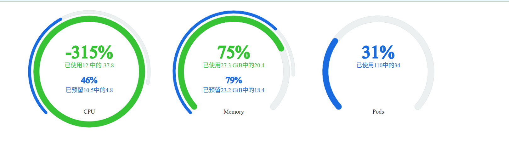

# Rancher 监控面板出现 CPU 利用率出现负数


## Rancher 监控面板出现 CPU 利用率出现负数



### Rancher 监控面板是怎么工作的

Rancher 定义了三种 CRD 用于支持监控面板的展示：

- `clustermonitorgraphs.management.cattle.io`
- `projectmonitorgraphs.management.cattle.io`
- `monitormetrics.management.cattle.io`

其中前两个是类似的，只是工作的上下文不太一样，用于定义监控图表需要的监控指标，`monitormetrics.management.cattle.io` 存储了监控指标对应的 Prometheus 查询表达式。

以集群监控图表为例，API 为：`/v3/clustermonitorgraphs?action=query`，相关代码在：`pkg/api/customization/monitor/cluster_graph_action.go#ClusterGraphHandler.QuerySeriesAction`。

简单来说，基本逻辑就是

1. 根据请求获取相关的 `clustermonitorgraphs.management.cattle.io`
2. 根据指标名称拿到 `monitormetrics.management.cattle.io`，提取出查询表达式
3. 根据请求参数和查询表达式得到真正的查询语句
4. 请求 Prometheus 得到相关数据
5. 转换成 API 响应并返回数据

### CPU 利用率出现负数的原因

这里我们看一下出现问题的 CPU 利用率图表的相关对象。

API 请求：

```json
{
	"filters":{
		"resourceType":"node",
		"clusterId":"c-64wdm"
	},
	"metricParams":{
		"instance":"c-64wdm:machine-jf48v"
	},
	"interval":"60s",
	"isDetails":false,
	"from":"now-1h",
	"to":"now"
}
```

```shell
➜ k get -n c-64wdm clustermonitorgraphs.management.cattle.io cluster-cpu-usage -o yaml
```

```yaml
apiVersion: management.cattle.io/v3
kind: ClusterMonitorGraph
metadata:
  labels:
    app: metric-expression
    cattle.io/creator: norman
    component: cluster
    level: cluster
    source: rancher-monitoring
  name: cluster-cpu-usage
  namespace: c-64wdm
  ...
spec:
  clusterName: ""
  detailsMetricsSelector:
    component: cluster
    details: "true"
    metric: cpu-usage-seconds-sum-rate
  metricsSelector:
    component: cluster
    details: "false"
    metric: cpu-usage-seconds-sum-rate
  priority: 100
  resourceType: cluster
  yAxis:
	unit: percent
```

```shell
➜ k get -n c-64wdm monitormetrics.management.cattle.io| grep cpu-usage-seconds-sum-rate
cluster-cpu-usage-seconds-sum-rate                               2d18h
cluster-cpu-usage-seconds-sum-rate-details                       2d18h
cpu-usage-seconds-sum-rate-details                               2d18h
node-cpu-usage-seconds-sum-rate                                  2d18h
node-cpu-usage-seconds-sum-rate-details                          2d18h
pod-cpu-usage-seconds-sum-rate                                   2d18h
pod-cpu-usage-seconds-sum-rate-details                           2d18h
workload-cpu-usage-seconds-sum-rate                              2d18h
workload-cpu-usage-seconds-sum-rate-details                      2d18h
```

```shell
➜ k get -n c-64wdm monitormetrics.management.cattle.io node-cpu-usage-seconds-sum-rate -o yaml
```

```yaml
apiVersion: management.cattle.io/v3
kind: MonitorMetric
metadata:
  labels:
    app: metric-expression
    cattle.io/creator: norman
    component: node
    details: "false"
    level: cluster
    metric: cpu-usage-seconds-sum-rate
    source: rancher-monitoring
  name: node-cpu-usage-seconds-sum-rate
  namespace: c-64wdm
  ...
spec:
  description: node cpu usage seconds sum rate
  expression: 1 - (avg(irate(node_cpu_seconds_total{mode="idle", instance=~"$instance"}[5m]))
    by (instance))
  legendFormat: CPU
```

可以看到 CPU 利用率最终的查询语句是 `1 - (avg(irate(node_cpu_seconds_total{mode="idle", instance=~"$instance"}[5m])) by (instance))`，而这个查询表达式确实是可能产生负数值的，具体原因跟数据采样和 `irate` 函数有关。

首先，监控指标是 Prometheus 通过定时执行任务去数据源抓取的，node_exporter 的指标是不返回时间戳的，此时**时间戳是抓取任务开始前取当前时间**：

> [scrape/scrape.go#L910](https://github.com/prometheus/prometheus/blob/f9d21f10ecd2a343a381044f131ea4e46381ce09/scrape/scrape.go#L910)

```go
func (sl *scrapeLoop) run(interval, timeout time.Duration, errc chan<- error) {
	...
mainLoop:
	for {
		...
		var (
			// 默认取任务开始时间为时间戳
			start             = time.Now()
			// 抓取任务可以配置超时时间
			scrapeCtx, cancel = context.WithTimeout(sl.ctx, timeout)
		)
		...
		// 抓取数据
		contentType, scrapeErr := sl.scraper.scrape(scrapeCtx, buf)
		cancel()
		...
		// 写入数据
		total, added, seriesAdded, appErr := sl.append(b, contentType, start)
		...
		select {
		case <-sl.parentCtx.Done():
			close(sl.stopped)
			return
		case <-sl.ctx.Done():
			break mainLoop
		// 当定时器触发时继续执行抓取任务
		case <-ticker.C:
		}
	}
	...
}
```

> [scrape/scrape.go#L1077](https://github.com/prometheus/prometheus/blob/f9d21f10ecd2a343a381044f131ea4e46381ce09/scrape/scrape.go#L1077)

```go
func (sl *scrapeLoop) append(b []byte, contentType string, ts time.Time) (total, added, seriesAdded int, err error) {
	var (
		app            = sl.appender()
		p              = textparse.New(b, contentType)
		defTime        = timestamp.FromTime(ts)
		appErrs        = appendErrors{}
		sampleLimitErr error
	)
	...
loop:
	for {
		var (
			et          textparse.Entry
			sampleAdded bool
		)
		// 遍历数据
		if et, err = p.Next(); err != nil {
			if err == io.EOF {
				err = nil
			}
			break
		}
		...
		total++

		t := defTime
		met, tp, v := p.Series()
		if !sl.honorTimestamps {
			tp = nil
		}
		// 如果使用数据源时间戳
		if tp != nil {
			t = *tp
		}
		...
		ce, ok := sl.cache.get(yoloString(met))
		if ok {
			// 写入数据
			err = app.AddFast(ce.ref, t, v)
			...
		}
		...
		added++

	}
	...
}
```

`irate` 函数是通过区间向量中最后两个样本数据来计算区间向量的增长速率：

> [promql/functions.go#L149](https://github.com/prometheus/prometheus/blob/5bb7f00d00ba2d73488630851b352974511c233a/promql/functions.go#L149)

```go
// === irate(node parser.ValueTypeMatrix) Vector ===
func funcIrate(vals []parser.Value, args parser.Expressions, enh *EvalNodeHelper) Vector {
	return instantValue(vals, enh.out, true)
}
...
func instantValue(vals []parser.Value, out Vector, isRate bool) Vector {
	samples := vals[0].(Matrix)[0]
	// No sense in trying to compute a rate without at least two points. Drop
	// this Vector element.
	if len(samples.Points) < 2 {
		return out
	}

	// 取最后两个指标值
	lastSample := samples.Points[len(samples.Points)-1]
	previousSample := samples.Points[len(samples.Points)-2]

	var resultValue float64
	if isRate && lastSample.V < previousSample.V {
		// Counter reset.
		resultValue = lastSample.V
	} else {
		// 最后两个指标值之差
		resultValue = lastSample.V - previousSample.V
	}

	sampledInterval := lastSample.T - previousSample.T
	if sampledInterval == 0 {
		// Avoid dividing by 0.
		return out
	}

	if isRate {
		// 结果等于最后两个指标值之差除以时间区间
		// Convert to per-second.
		resultValue /= float64(sampledInterval) / 1000
	}

	return append(out, Sample{
		Point: Point{V: resultValue},
	})
}
```

CPU 空闲时间秒数 `node_cpu_seconds_total{mode="idle"}` 理论上说不会超过两次抓取时间间隔秒数，但当开始抓取到实际抓取到数据的时间存在明显的延迟时，就会出现增长率大于 100% 的情况。例如：

1. 时间 T 启动数据抓取任务，立即得到 T 时刻数据 V，即正常写入数据
2. 时间 T + 5s 再次启动数据抓取任务，但是因为负载等问题造成取数据有延迟，得到 T + 15s 时刻的数据 V + 15 并写入

此时如果以这两次采样计算瞬时的增长率：

$$
irate = \frac{V + 15 - V}{T + 5 - T} = 3
$$

CPU 空置率为 300%，那么 CPU 利用率为 `(1 - 3) * 100% = -200%`。

不过这个异常场景可能是**充分不必要**的，在网上也找到类似问题[^idle-issue]，还有说跟在虚拟机中使用 node_exporter 有关[^vm-issue]，但没有具体细节无法继续深入。

[^idle-issue]: [Node Exporter shows Wrong Idle CPU time - stackoverflow](https://stackoverflow.com/questions/58765381/node-exporter-shows-wrong-idle-cpu-time)，[negative values with irate #1287](https://github.com/prometheus/prometheus/issues/1287#issuecomment-169307350)，[Prometheus query returns invalid value - stackoverflow](https://stackoverflow.com/questions/43301733/prometheus-query-returns-invalid-value)，[node_cpu_seconds_total values are not monotonically increasing #1686](https://github.com/prometheus/node_exporter/issues/1686)

[^vm-issue]: [Negative values with Rate function used for CPU usage metric by node_exporter](https://groups.google.com/forum/#!searchin/prometheus-users/cpu$20negative|sort:date/prometheus-users/yuplkBnxjHw/eCINkDwlCgAJ)

此外，上面的解释也并不是说使用 `irate` 函数就是有问题的，官方文档也做了说明，`irate` 函数更适合快速变化的计数器，而 `rate` 函数更适合观察长期趋势。查询 CPU 利用率使用 `irate` 完全是没问题的。

> irate should only be used when graphing volatile, fast-moving counters. Use rate for alerts and slow-moving counters, as brief changes in the rate can reset the FOR clause and graphs consisting entirely of rare spikes are hard to read.

到这里对于这个问题得到的结论是：

1. Rancher Server 逻辑是没有问题，查询语句是正确的
2. Prometheus 和 node_exporter 数据采集逻辑本身没有问题
3. 外部因素例如高负载造成的数据延迟，内核及环境问题可能造成**数据异常**

总的来说，这个问题产生的监控数据异常一般来说只是瞬时的，对整体监控影响不大，但是此时我们就要关注相关节点和组件负载是否有异常表现，一瞬间的监控数据异常可能背后有更深层次的原因。

附：关于为什么不推荐在数据源设置时间戳可以看这个 issue ：[Consider allowing setting a timestamp for ConstMetrics. #187](https://github.com/prometheus/client_golang/issues/187)

