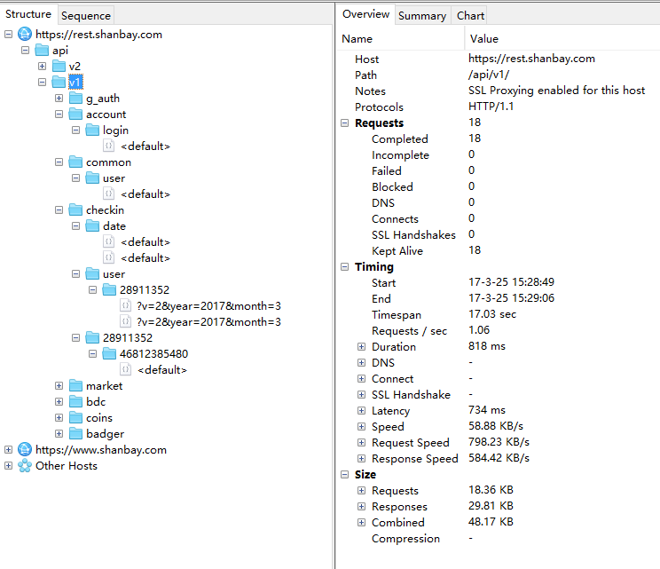
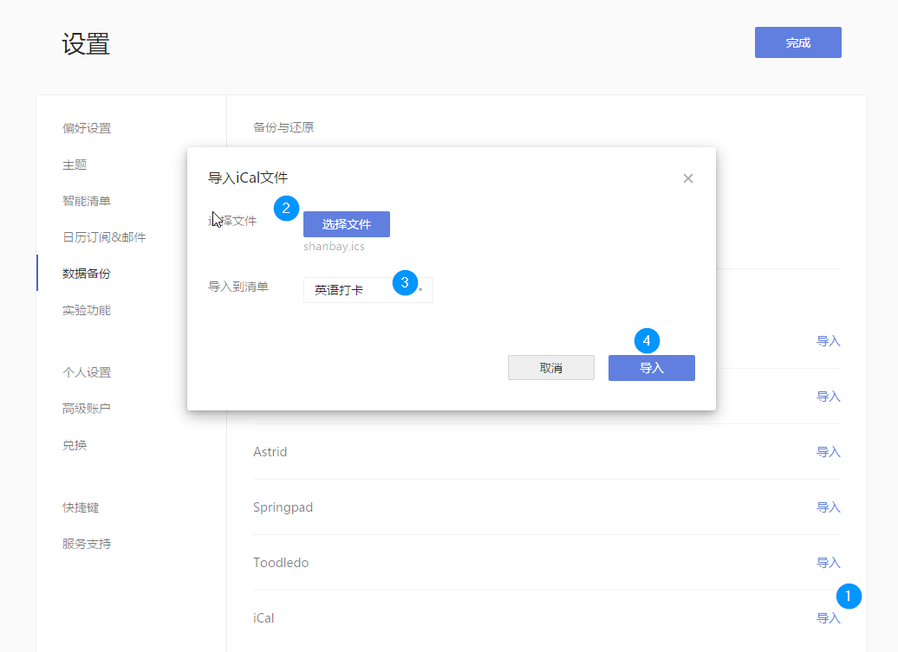

# 使用Python导出扇贝应用打卡日历


我一直使用嘀嗒清单做待办清单，它支持丰富的数据导入导出功能，强大的时间定义和日历功能，让我有了将它作为习惯和目标管理工具的想法。

因为之前有使用其数据导入功能添加个人课表的[经验](http://hfut.readthedocs.io/zh_CN/latest/advanced.html#id3)，所以这次我决定将我的扇贝打卡日历导出为ical文件再导入到嘀嗒清单。

既然是导出扇贝应用打卡日历，其核心就是使用一定的方式获取到我们所需要的数据。以往我们习惯的做法是通过网页爬虫解析页面得到我们所要抓取的数据，但对于有客户端的应用，我们首先应该想到的是对客户端数据进行抓包分析，一般就能够直接得到我们所需要的数据接口了。

在这里我使用的是[Charles](https://www.charlesproxy.com)进行HTTP抓包。

我们首先打开Charles，在手机上注销掉扇贝单词的账号，设置网络代理用于抓包（如果手机没有安装Charles的根证书用于解密HTTPS需要先安装证书），然后填写我们的账号和密码进行登录抓包。

关于抓包及分析数据在这里我们就不做赘述了，基本接口在Charles显示的结果如下:



因为请求的内容有个人的敏感数据，实际的接口操作我们只需要看代码即可:

```Python
# -*- coding:utf-8 -*-
import logging
import requests
import icalendar

from urllib.parse import urljoin
from datetime import datetime


def _init_logger():
    logger = logging.Logger("shanbay", logging.INFO)
    sh = logging.StreamHandler()
    # https://docs.python.org/3/library/logging.html#logrecord-attributes
    fmt = logging.Formatter('%(asctime)s[%(levelname)s]: %(message)s')
    sh.setFormatter(fmt)
    logger.addHandler(sh)
    return logger


logger = _init_logger()


class RequestError(Exception):
    pass


class Shanbay:
    _base_url = "https://rest.shanbay.com/"

    def __init__(self, account, password):
        self.session = requests.Session()
        self._login(account, password)
        self.user = self.get_user_info()

    def _urljoin(self, path):
        return urljoin(self._base_url, path)

    @staticmethod
    def _check_response_status(response_json):
        """
        检查响应是否有错, 没有错误便返回data字段
        """
        if "status_code" not in response_json:
            raise RequestError(response_json["msg"])
        if response_json["status_code"] != 0:
            raise RequestError(
                "请求错误 {res[status_code]}: {res[msg]}".format(res=response_json)
            )
        return response_json["data"]

    def _login(self, account, password):
        """
        登陆接口
        :param account: 扇贝账号
        :param password: 扇贝账号密码
        :return: 登陆状态
        """
        # 直接登陆扇贝, 不存储用户名和密码
        login_status = self.session.put(
            self._urljoin("api/v1/account/login/"),
            json={
                "username": account,
                "password": password
            }
        ).json()
        self._check_response_status(login_status)

    def get_user_info(self):
        """
        获取个人信息
        """
        user_info = self.session.get(self._urljoin("api/v1/common/user/")).json()
        user_info = self._check_response_status(user_info)
        # 对用户信息做缓存用于得到接口的默认user_id参数
        self.user = user_info
        return user_info

    def get_checkin_date(self):
        """
        获取当前打卡日期
        """
        checkin_date = self.session.get(self._urljoin("/api/v1/checkin/date/")).json()
        return self._check_response_status(checkin_date)

    def get_checkins(self, year=None, month=None, user_id=None, v=3):
        """
        获取打卡日历
        :param year: 年份, 不提供时为当前年份
        :param month: 月份, 不提供时为当前月份
        :param user_id: 用户ID, 不提供时为登陆用户id
        :param v: 返回的结果详细程度,
            1 只返回相应日期是否打卡
            3 返回相应日期的打卡id和打卡天数, 没打卡则为空
            2 在 3 的基础上添加了分享相关的数据
        """
        d = datetime.today()
        if year is None:
            year = d.year
        if month is None:
            month = d.month
        if user_id is None:
            user_id = self.user["user_id"]
        checkins = self.session.get(
            self._urljoin("api/v1/checkin/user/%s/" % user_id),
            params={"year": year, "month": month, "v": v}
        ).json()
        checkins = self._check_response_status(checkins)
        return checkins

    def get_checkin_detail(self, checkin_id, user_id=None):
        """
        获取打卡详情
        :param checkin_id: 打卡记录id
        :param user_id: 用户ID, 不提供时为登陆用户id
        """
        if user_id is None:
            user_id = self.user["user_id"]
        checkin_detail = self.session.get(self._urljoin("/api/v1/checkin/{}/{}/".format(user_id, checkin_id))).json()
        checkin_detail = self._check_response_status(checkin_detail)
        return checkin_detail

    def export2ical(self, use_todo=True):
        """
        将打卡记录导出为ical
        :param use_todo: 是否使用 TODO 作为记录, false 时使用 Event 作为记录
        :return:
        """
        cls = icalendar.Todo if use_todo else icalendar.Event
        # https://zh.wikipedia.org/wiki/ICalendar
        # http://icalendar.readthedocs.io/en/latest
        # https://tools.ietf.org/html/rfc5545
        cal = icalendar.Calendar()
        cal.add("X-WR-TIMEZONE", self.get_checkin_date()["timezone"])
        cal.add('X-WR-CALNAME', "{[nickname]}的扇贝打卡日历".format(self.user))

        d = datetime.today()
        year = d.year
        month = d.month
        # 扇贝 2011 才创立
        day = (year - 2011 + 1) * 365
        # 记录计数, 用于确认实际导出数量与服务器记录天数一致
        count = 0
        # 当打卡天数更新到第一天时表示所有记录已导出
        while day != 1:
            logger.info("获取{}年{}月的打卡详情".format(year, month))
            checks = self.get_checkins(year, month)
            dates = sorted(checks.keys(), reverse=True)
            for c in checks.values():
                # 没有打卡的天数内容为空
                if not c:
                    continue
                checkin_detail = self.get_checkin_detail(c["id"])
                day = min(day, checkin_detail["num_checkin_days"])
                # "事件"组件更具通用性, Google 日历不支持"待办"组件
                item = cls(
                    SUMMARY="扇贝打卡-{}".format(checkin_detail["num_checkin_days"]),
                    # 开始时间为打卡当天零点
                    DTSTART=icalendar.vDatetime(datetime.strptime(checkin_detail["checkin_date"], "%Y-%m-%d")),
                    # 结束时间为打卡时间
                    DTEND=icalendar.vDatetime(datetime.strptime(checkin_detail["checkin_time"], "%Y-%m-%dT%H:%M:%S")),
                    # 任务描述为打卡时间统计与打卡日记
                    DESCRIPTION="{}\n{}".format(checkin_detail["info"], checkin_detail["note"])
                )
                # https://tools.ietf.org/html/rfc5545#section-3.2.12
                if use_todo:
                    item.add("STATUS", "COMPLETED")
                else:
                    item.add("STATUS", "ACCEPTED")
                cal.add_component(item)
                count += 1
            # 当前月份记录已添加, 月份调整到上一个月份
            month -= 1
            # 当月份为0表示本年度记录已添加, 月份由1月调整到上一个月份, 即12月, 年份相应的上调一年
            if month == 0:
                month = 12
                year -= 1
        # 检查导出记录数量是否与服务器记录天数一致
        assert count == self.user["checkin_days"]
        logger.info("共导出 {} 条打卡记录".format(count))
        return cal


if __name__ == '__main__':
    sb = Shanbay("扇贝账号", "密码")
    cal = sb.export2ical()
    with open('shanbay.ics', 'wb') as fp:
        fp.write(cal.to_ical())

```

如果你想将你打卡日历导出，只需将最下面的“扇贝账号”，“密码”替换成你响应的账号密码后运行此脚本，即可在当前目录获得导出的`shanbay.ics`文件。

以嘀嗒清单为例，导入步骤如下图:



需要注意的是，导入到的清单最好是一个新建的空白清单，因为导入到非空清单后你要是想重新导入需要删除原来的数据。

最终的使用效果:


