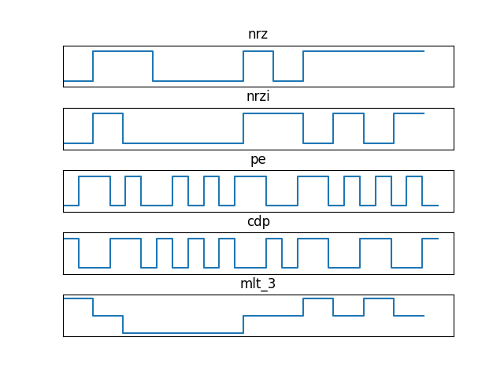

# 计算机网络信道的数字编码


## 背景

数字编码指的是把数字形式的数据以数字信号方式在信道上传输的技术。最简单的想法就是使用非归零编码（NRZ， 正电压为 1， 负电压为 0），但是由于在数据通信中发送方和接收方的时钟无法精确同步，**时钟漂移** 问题会使数据传送发生错误。

另外，接受方通过将当前接收到的信号与之前接收的信号的平均值进行比较判断接收的比特是 0 还是 1，但是传输的比特为连续的 1 或 0 时就会改变这个平均这，产生 **基线漂移**。

为了解决这些问题，一系列编码方式开始产生，包括 **非归零反转** 编码，**曼彻斯特** 编码 **差分曼彻斯特** 编码等等，同时为了提升传输效率又产生了 **4B/5B** 编码和 **MLT-3** 编码。

## 各个编码的特征

1. 非归零编码
    - 特征： 高 1 低 0
    - 优点： 简单
    - 缺点： 抗干扰能力极差，实际不使用这种编码
2. 非归零反转编码
    - 特征： 差分编码，1 跳 0 不跳
    - 优点： 抗干扰能力更强
    - 缺点： 编解码更复杂，对连续为 0 的情况无能为力
3. 曼彻斯特编码
    - 特征： 自同步，每个比特跳变一次且 1，0 对应的跳变是不变的
    - 优点： 能够保持通信同步
    - 缺点： 编码效率低，只有 50%
4. 差分曼彻斯特编码
    - 特征： 差分编码，比特开始时，有跳为 0，无跳为 1
    - 优点： 能够保持通信同步
    - 缺点： 编码效率低，只有 50%
5. 4B/5B 编码
    - 特征： 将数据以 4 比特为一组进行分割并映射为 5 比特码组
    - 优点： 保持通信同步的同时将效率提高到 80%
    - 缺点： 直接用在 100Mbps 的双绞线可能会因带宽不够出现问题
6. MLT-3 编码
    - 特征：差分编码，0 不跳 1 跳反
    - 优点：4 比特对应一个信号模式（-V，0，+V，0）
    - 缺点：最坏情况下，信号波特率为数据速率的 1/4

## 编码规则

编码规则我使用了 Python 进行实现，为了使规则简单易懂，没有对函数进一步抽象，同时进行了注释有助于理解。

另外 **4B/5B** 编码为简单的映射编码，十分简单，编写冗长的映射表没有意义，故不作实现。

以下为实现代码：

```python
HIGH_LEVEL_SIGNAL = 1
LOW_LEVEL_SIGNAL = 0
NEGATIVE_HIGH_LEVEL_SIGNAL = -1


def nrz(signal):
    """
    非归零编码
    """
    return signal


def nrzi(signal):
    """
    非归零反转编码, 1 跳变, 0 不跳变.
    """
    prev = LOW_LEVEL_SIGNAL
    result = []
    for v in signal:
        if v == HIGH_LEVEL_SIGNAL:
            if prev == HIGH_LEVEL_SIGNAL:
                v = LOW_LEVEL_SIGNAL
            elif prev == LOW_LEVEL_SIGNAL:
                v = HIGH_LEVEL_SIGNAL
        elif v == LOW_LEVEL_SIGNAL:
            v = prev
        result.append(v)
        prev = v
    return result


def pe(signal):
    """
    曼彻斯特编码(Manchester Encoding), 也叫做相位编码(Phase Encode,简写PE)
    关于中间电平跳变观点有歧义:
        第一种
            G. E. Thomas, Andrew S. Tanenbaum1949年提出的, 它规定0是由低-高的电平跳变表示, 1是高-低的电平跳变.
        第二种
            IEEE 802.4(令牌总线)和低速版的IEEE 802.3(以太网)中规定, 按照这样的说法, 低-高电平跳变表示1, 高-低的电平跳变表示0.
    由于有以上两种不同的表示方法, 所以有些地方会出现歧异. 当然, 这可以在差分曼彻斯特编码(Differential Manchester encoding)方式中克服.

    样例程序使用第一种观点.
    """
    result = []
    for v in signal:
        if v == HIGH_LEVEL_SIGNAL:
            v = [1, 0]
        elif v == LOW_LEVEL_SIGNAL:
            v = [0, 1]
        result.extend(v)
    return result


def cdp(signal, reverse_start=False):
    """
    差分曼彻斯特编码又叫条件双相码(CDP码).
    主要看两个相邻的波形,如果后一个波形和前一个的波形相同,则后一个波形表示0,如果波形不同,则表示1.

    [注意]:如果在最初信号的时候,即第一个信号时(IEEE 802.3标准):
        如果中间位电平从低到高,则表示0；
        如果中间位电平从高到低,则表示1；
    """
    first = signal[0]
    if first == HIGH_LEVEL_SIGNAL:
        first = [1, 0]
    elif first == LOW_LEVEL_SIGNAL:
        first = [0, 1]
    if reverse_start:
        first.reverse()
    prev = first
    result = []
    result.extend(prev)
    for v in signal[1:]:
        if v == HIGH_LEVEL_SIGNAL:
            # 无跳变表示1, 波形与前一个相反
            prev.reverse()
            v = prev
        elif v == LOW_LEVEL_SIGNAL:
            # 有跳变表示0, 波形与前一个相同
            v = prev
        result.extend(v)
    return result


def mlt_3(signal):
    """
    MLT-3 编码
    1.如果下一比特是0，则输出值与前面的值相同；
    2.如果下一比特是1，则输出值就要有一个转变：
        如果前面输出的值是+V或-V，则下一输出为0；如果前面输出的值是0，则下一输出的值与上一个非0值符号相反
    """
    last_nonzero = LOW_LEVEL_SIGNAL
    prev = HIGH_LEVEL_SIGNAL
    result = []
    for v in signal:
        if v == HIGH_LEVEL_SIGNAL:
            if prev != LOW_LEVEL_SIGNAL:
                v = LOW_LEVEL_SIGNAL
            else:
                if last_nonzero == LOW_LEVEL_SIGNAL:
                    v = NEGATIVE_HIGH_LEVEL_SIGNAL
                elif last_nonzero == NEGATIVE_HIGH_LEVEL_SIGNAL:
                    v = HIGH_LEVEL_SIGNAL
                last_nonzero = v
        elif v == LOW_LEVEL_SIGNAL:
            # 为0则波形与前一个相同
            v = prev
        result.append(v)
        prev = v
    return result


if __name__ == "__main__":
    signal = list(map(int, "011000101111"))
    print('非归零编码:', nrz(signal))
    print('非归零反转编码:', nrzi(signal))
    print('曼彻斯特编码:', pe(signal))
    print('差分曼彻斯特编码:', cdp(signal))
    print('MLT-3 编码:', mlt_3(signal))


    from pylab import *
    x = range(0, len(signal) + 1)
    x2 = range(0, len(signal) * 2 + 1)
    y = signal

    subplot(511)
    nrz_result = nrz(signal)  # 非归零编码
    title("nrz")
    axis([0, len(x), -0.2, 1.2])
    grid(True)
    frame = gca()
    frame.axes.get_xaxis().set_visible(False)
    frame.axes.get_yaxis().set_visible(False)
    step(x, nrz_result[:1] + nrz_result, label="nrz")

    subplot(512)
    nrzi_result = nrzi(signal)  # 非归零反转编码
    title("nrzi")
    axis([0, len(x), -0.2, 1.2])
    grid(True)
    frame = gca()
    frame.axes.get_xaxis().set_visible(False)
    frame.axes.get_yaxis().set_visible(False)
    step(x, nrzi_result[:1] + nrzi_result, label="nrzi")

    subplot(513)
    pe_result = pe(signal)  # 曼彻斯特编码
    title("pe")
    axis([0, len(x2), -0.2, 1.2])
    grid(True)
    frame = gca()
    frame.axes.get_xaxis().set_visible(False)
    frame.axes.get_yaxis().set_visible(False)
    step(x2, pe_result[:1] + pe_result, label="pe")

    subplot(514)
    cdp_result = cdp(signal, reverse_start=True)  # 差分曼彻斯特编码
    title("cdp")
    axis([0, len(x2), -0.2, amax(y) * 1.2])
    grid(True)
    frame = gca()
    frame.axes.get_xaxis().set_visible(False)
    frame.axes.get_yaxis().set_visible(False)
    step(x2, cdp_result[:1] + cdp_result, label="cdp")

    subplot(515)
    mlt_3_result = mlt_3(signal)  # MLT-3编码
    title("mlt_3")
    axis([0, len(x), -1.2, amax(y) * 1.2])
    grid(True)
    frame = gca()
    frame.axes.get_xaxis().set_visible(False)
    frame.axes.get_yaxis().set_visible(False)
    step(x, mlt_3_result[:1] + mlt_3_result, label="mlt_3")

    subplots_adjust(hspace=0.5)
    show()
```

输出结果：

```text
非归零编码: [0, 1, 1, 0, 0, 0, 1, 0, 1, 1, 1, 1]
非归零反转编码: [0, 1, 0, 0, 0, 0, 1, 1, 0, 1, 0, 1]
曼彻斯特编码: [0, 1, 1, 0, 1, 0, 0, 1, 0, 1, 0, 1, 1, 0, 0, 1, 1, 0, 1, 0, 1, 0, 1, 0]
差分曼彻斯特编码: [0, 1, 1, 0, 0, 1, 0, 1, 0, 1, 0, 1, 1, 0, 1, 0, 0, 1, 1, 0, 0, 1, 1, 0]
MLT-3 编码: [1, 0, -1, -1, -1, -1, 0, 0, 1, 0, 1, 0]
```

对比图像：



