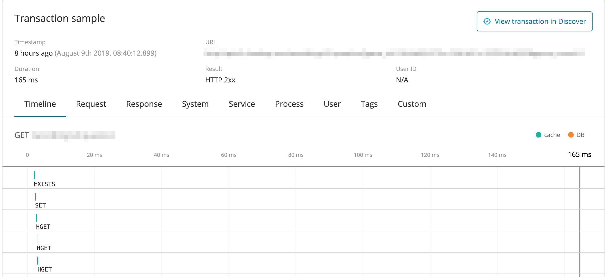
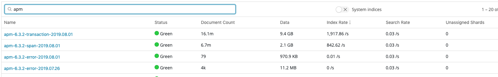
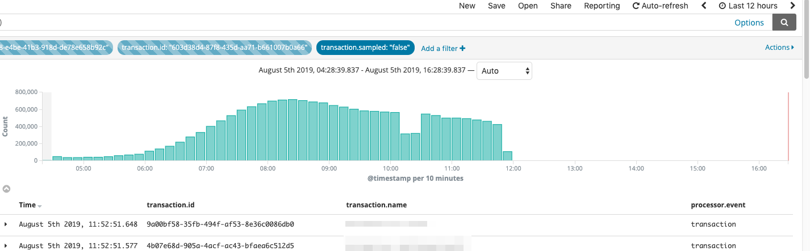
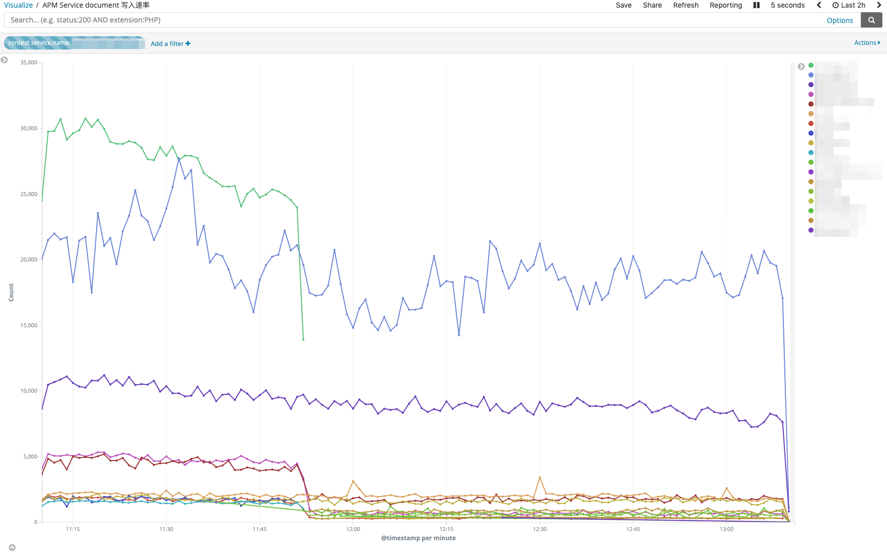
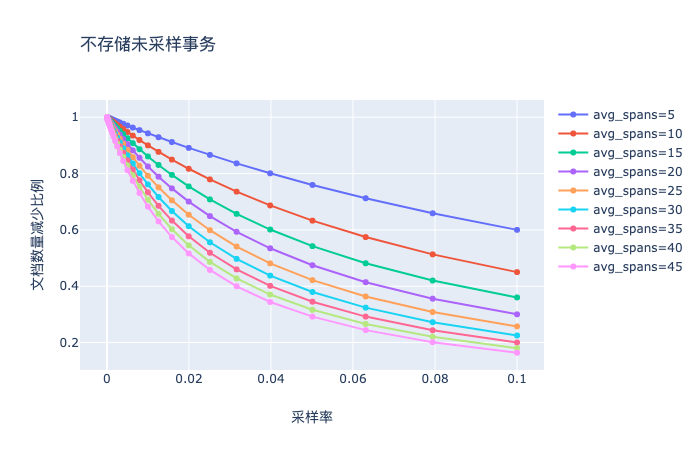

# 记一次 Elastic APM 性能调优


## 问题背景

- 公司核心项目接入并且流量切换至新版后对 ES 集群性能产生了较大影响
- 同时有几个项目流量较大, 均未接入 APM, 但是需要接入
- 瓶颈在 ES 集群而不是 APM Server, agent 到 apm-server,  apm-server 到 ES 集群都是批量操作
- 偶尔会出现 APM 写入不够导致触发大量报错, 然后 raw 写入更多的恶性循环

## ES APM 基本原理

一个 transaction 会创建多个 ES document, 其中有两类:

- transaction: 一个 transaction 对应一条, 记录该 transaction 的元信息和总体的请求时间


- span: 一个 transaction 对应多条, 该 transaction 具体包括哪些调用, 数量取决于子调用的数量和配置的 `TRANSACTION_MAX_SPANS` (默认 500)



### OpenTracing

关于 tracing 的基本原理可以去看一下 [OpenTracing 语义标准](https://opentracing-contrib.github.io/opentracing-specification-zh/specification.html) , Elastic APM 也提供了对该语义标准的 [支持](https://www.elastic.co/guide/en/apm/get-started/current/opentracing.html)

## 调优

### 采样率 TRANSACTION_SAMPLE_RATE

采样率指的是 transaction 有多大的概率被 **完整地** 发送至 APM Server

设

- 每秒请求量 $QPS$
- ES 每秒写入量 $EsQPS$

$$
EsQPS = SampledEsQPS + UnsampledEsQPS
$$

其中

$$
\begin{aligned}
SampledEsQPS &= QPS * SampleRate * (AvgSpanNum + 1)
\\\\
UnsampledEsQPS &= QPS * (1- SampleRate) * 1
\\\\
EsQPS &= QPS * (SampleRate * (AvgSpanNum + 1) + (1- SampleRate))
\\\\
&= QPS * (SampleRate * AvgSpanNum + 1)
\\\\
SampleRate &= \frac{EsQPS \div QPS - 1}{AvgSpanNum}
\\\\
AvgSpanNum &= \frac{EsQPS \div QPS - 1}{SampleRate}
\end{aligned}
$$

假设一个请求对应一个 transaction

$$
ApmDelay = \frac{1 \div SampleRate}{QPS}
$$

$ApmDelay$ 表示 $QPS$ 在 $x$ 时大约 $QPS * SampleRate$ 秒能观测到 span 数据

此时我们便可以根据 $ApmDelay$ 和 $QPS$ 设定合适的采样率

## APM Server

> We still record overall time and the result for unsampled transactions, but no context information, labels, or spans.

根据官方文档的说明, **即使未被采样仍然会产生一些统计数据**, 从我们的实际使用场景来说, 每秒 transaction 数量, 平均请求时间等信息通过服务网关能做到实时监控, APM 这些数据不准确是可以接受的, 通过过滤这些数据, 能够减轻 Elastic Search 集群的写入压力和磁盘压力



通过配置, 不将未采样的 transaction 发往 ES 集群

```yaml
processors:
 - drop_event:
     when:
       equals:
         transaction.sampled: false
```

可以看到, 配置后 APM Server 不再写入未被采样的 transaction 数据



观察调整后 ES 数据写入速率的变化



其中写入量没有变化的服务采样率为 1

绿线代表的服务采样率为 $10^{-6}$

对于采样率不够低的服务, 不存储未采样的 transaction 的服务写入量没有明显变化

### 效果如何

这里简单根据公式:

$$
\begin{aligned}
TPS &= UnampledTrans + SampledTrans * (1 + AvgSpans)
\\\\
EsQPS &= TPS * (1- SampleRate) + TPS * SampleRate * (1 + AvgSpans)
\end{aligned}
$$

可以得到一张关于图, 可以看到, 在采样率低于 0.1 的时候, 优化效果是比较明显的, 不过 transaction 的平均 span 数量 (AvgSpans) 越大, 得到的效果越差



## 附录

- [APM Python Agent Reference » Configuration](https://www.elastic.co/guide/en/apm/agent/python/current/configuration.html)
- [Agent tuning and overhead](https://www.elastic.co/guide/en/apm/agent/python/current/tuning-and-overhead.html)
- [Tune APM Server](https://www.elastic.co/guide/en/apm/server/7.2/tune-apm-server.html)

