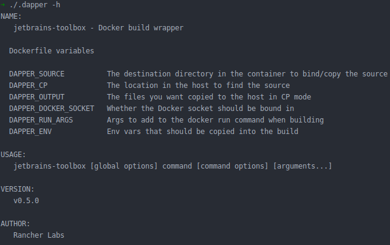
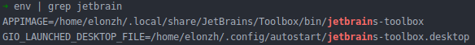
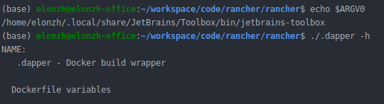
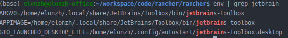

# 貍猫换太子？程序启动参数谜案


这几天在研究 Rancher 项目的源码，在准备开发环境的过程中发现其提供的 build 工具 dapper 输出帮助信息很奇怪，输出的程序名称竟然为 `jetbrains-toolbox`，第一反应是可能跟启动参数有关，随后开始了进一步调查。

在 IDEA 中显示的程序帮助：



## 验证问题是否和启动参数有关

```makefile
.dapper:
	@echo Downloading dapper
	@curl -sL https://releases.rancher.com/dapper/latest/dapper-`uname -s`-`uname -m` > .dapper.tmp
	@@chmod +x .dapper.tmp
	@./.dapper.tmp -v
	@mv .dapper.tmp .dapper
```

rancher 项目目录下生成的 `.dapper` 是在 Makefile 中下载下来的，并不是直接编译的，

```go
func main() {
   ...
	app := cli.NewApp()
	app.Author = "Rancher Labs"
	app.EnableBashCompletion = true
	app.Version = VERSION
   app.Usage = `Docker build wrapper
   ...
```

dapper 使用 [github.com/urfave/cli](https://github.com/urfave/cli) 这个包作为应用框架，代码中没有明确指定应用名称，看来应该是框架处理的，

```go
func NewApp() *App {
	return &App{
		Name:         filepath.Base(os.Args[0]),
		HelpName:     filepath.Base(os.Args[0]),
		Usage:        "A new cli application",
		...
	}
}
```

果然，框架使用 `filepath.Base(os.Args[0])` 作为默认的应用名称，看来确实因为启动参数的问题导致的输出错误。

## 是谁改变了启动参数呢

考虑到我是在 JetBrains Toolbox 启动的 IDEA，然后在 IDEA 启动的终端，可能是 JetBrains Toolbox 的某些环境变量一路传递到了终端里，我尝试着过滤了下可能的环境变量。



出现了可疑的环境变量，其中 `APPIMAGE` 看上去是和 Linux 应用的打包格式 [AppImage](https://appimage.org/) 有关系，但是这两个环境变量看上去和 `os.Args` 没有什么关系，从 [AppImage 文档](https://docs.appimage.org/packaging-guide/environment-variables.html#type-2-appimage-runtime) 中了解到 AppImage 运行时会设置几个环境变量，其中有一个 `ARGV0`：

> ARGV0
>
> Name/path used to execute the script. This corresponds to the value you’d normally receive via the argv argument passed to your main method. Usually contains the filename or path to the AppImage, relative to the current working directory.

看起来和它有关，把它删除掉看看有什么效果，


输出正常了！那为什么 `ARGV0` 会影响到终端程序的启动参数呢，难道这是一个通用的环境变量吗？再次祭出谷歌大法，找到个一个问题：

[Setting environmental variable ARGV0 cause some packed software malfunctioning #852](https://github.com/AppImage/AppImageKit/issues/852)

原来这是个已知问题，因为我使用的 shell 是 zsh，而 zsh 会使用 `ARGV0` 环境变量作为第一个参数执行程序。

http://zsh.sourceforge.net/Doc/Release/Parameters.html#Parameters-Used-By-The-Shell

```text
ARGV0
   If exported, its value is used as the argv[0] of external commands. Usually used in constructs like ‘ARGV0=emacs nethack’.
```

到这里结论就很清晰了，将 IDEA 的默认 shell 改为 bash，`ARGV0` 仍然存在，但已经不会影响程序的输出了。



等等！一般来说 `os.Args` 第一个参数就是程序的路径，难道可以允许和实际程序路径不一样？

这就得从 Linux 系统调用说起了，`os.Args[0]` 指代的是程序的名称，但这跟其他参数本质上没什么区别，并不要求一定是程序执行路径，具体信息可以参照下面两个链接，这里就不展开了。

- [Why does argv include the program name?](https://unix.stackexchange.com/questions/315812/why-does-argv-include-the-program-name)
- [EXEC(3) man page](http://man7.org/linux/man-pages/man3/exec.3.html)

## 总结

- AppImage 运行时会设置 `ARGV0` 环境变量，而 jetbrains-toolbox 使用的是 AppImage 打包；
- 从 jetbrains-toolbox 启动 IDEA 会复制父进程的环境变量；
- IDEA 使用的 shell 是 zsh，而 zsh 会使用 `ARGV0` 环境变量作为 `os.Args[0]`；
- `os.Args[0]` 是程序的名字，并不是必须的或者必须是实际程序路径。

## 补充问题

你们知道为什么当时过滤 jetbrains 环境变量为什么没有过滤出来 `ARGV0` 吗？

提示，在 bash 下是可以过滤出来的：



